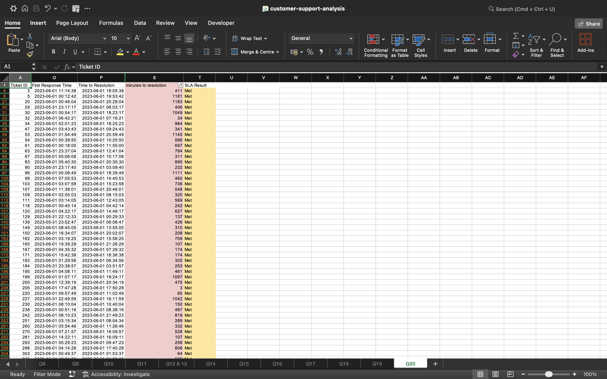
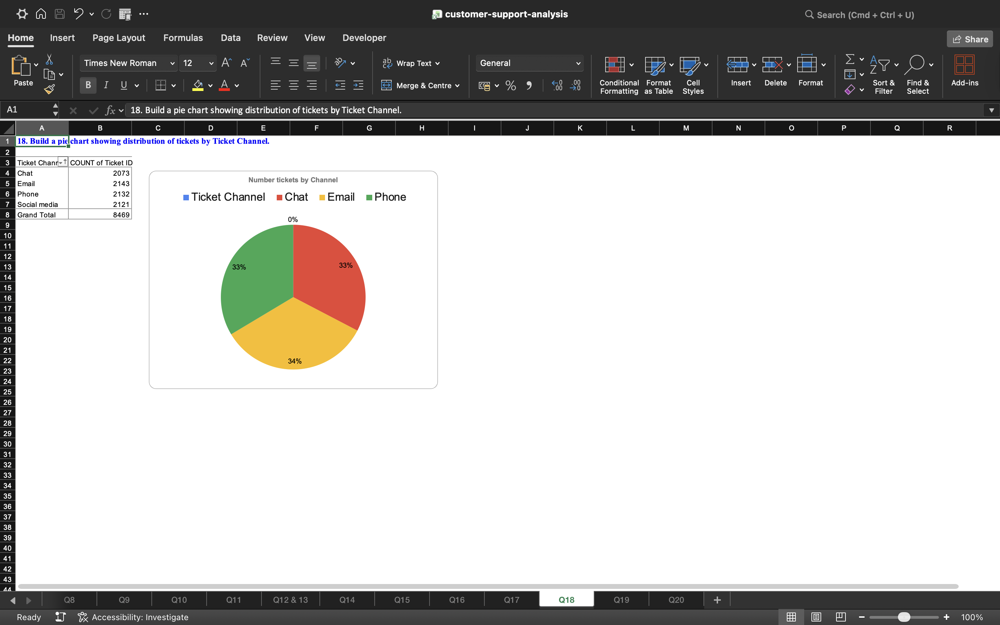
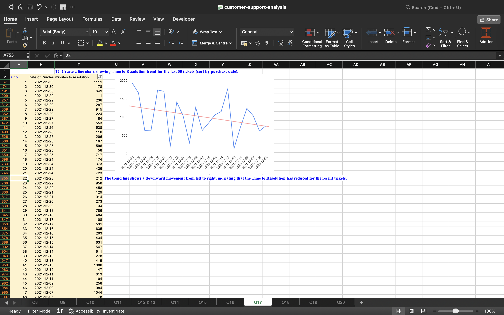
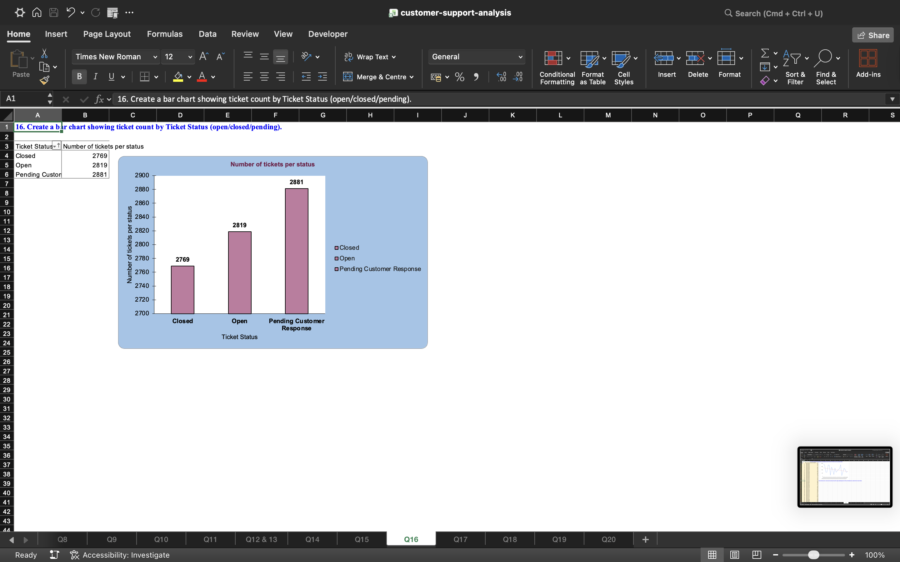

# Customer Support Ticket Analysis (Excel)

## Overview
This project analyzes customer support ticket data to identify trends, resolution time and customer satisfaction patterns.

## Tools Used
- Microsoft Excel
- Pivot Tables
- Data Cleaning

## Key Analysis
- Identified peak ticket periods
- Analyzed resolution time trends
- Evaluated customer satisfaction metrics

## Outcome
Provided insights to improve customer support efficiency and decision-making.

## Dashboard Preview

